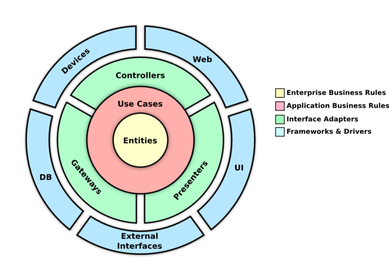

# React Clean Architeture Aplication

Application developed in React.js following the principles of clean architecture

## Technologies used

- [React](https://pt-br.reactjs.org/)
- [Typescript](https://www.typescriptlang.org/)
- [Tailwind CSS](https://tailwindcss.com/)
- [Jest](https://jestjs.io/)
- [Testing Library](https://testing-library.com/docs/react-testing-library/intro)

## Running

Inside the newly created project, you can run some built-in commands:

### `npm start` or `yarn start`

Runs the app in development mode. 
Open [http://localhost:3000](http://localhost:3000) to view it in the browser.

The page will automatically reload if you make changes to the code. 
You will see the build errors and lint warnings in the console.

### `npm test` or `yarn test`

Runs the test. 

### `npm test:cov` or `yarn test:cov`

Runs the test and generate coverage. 

### `npm run build` or `yarn build`

Builds the app for production to the `dist` folder. 

Your app is ready to be deployed.

## License

This project is licensed under the [MIT License](https://opensource.org/licenses/MIT).

Development by: [andrecoelho.dev](https://andrecoelho.dev) | Software Engineer
